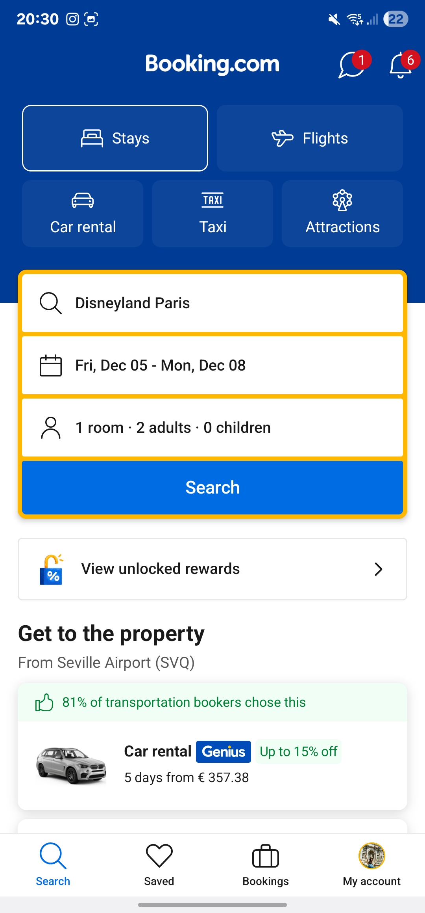
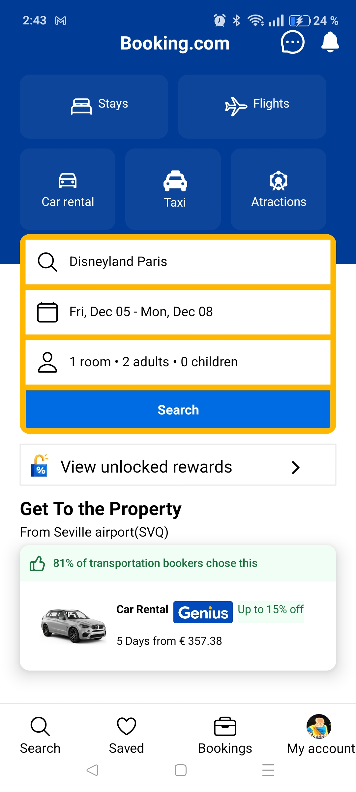

# AppScreen Booking

## Objetivo

Realizar una aplicación de React Native adaptada de la captura de pantalla propuesta por el profesor. En este caso de la aplicación para móvil de Booking.com

## Desarrollo del ejercicio práctico:

1.	Utiliza alguna herramienta para obtener el código de cada color utilizado en la aplicación y guárdalos en un fichero de typescript para los colores de tu aplicación.

[Doc01-Color](./documents/Doc01-Color.md)

2.	Basándote en el principio de Atomic Design, explica cómo has organizado los elementos visuales que conforman la app en componentes core de React Native y los tuyos propios. Recuerda indicar el nombre de los componentes.

[Doc02-Atomic-Design](./documents/Doc02-Atomic-design.md)

3.	Explica, apoyándote en el código, como has realizado la implementación de algún componente propio.

[Doc03-Component-Impl](./documents/Doc03-Component-Impl.md)

4.	Indica en una tabla cuáles han sido los iconos que has incorporado a tu proyecto y cómo los has implementado. Si son de la misma librería, basta con explicar la implementación de uno.

[Doc04-Icons](./documents/Doc04-Icons.md)

## Resultado de la aplicacion

Imagen Original:

  

Imagen del resultado:

