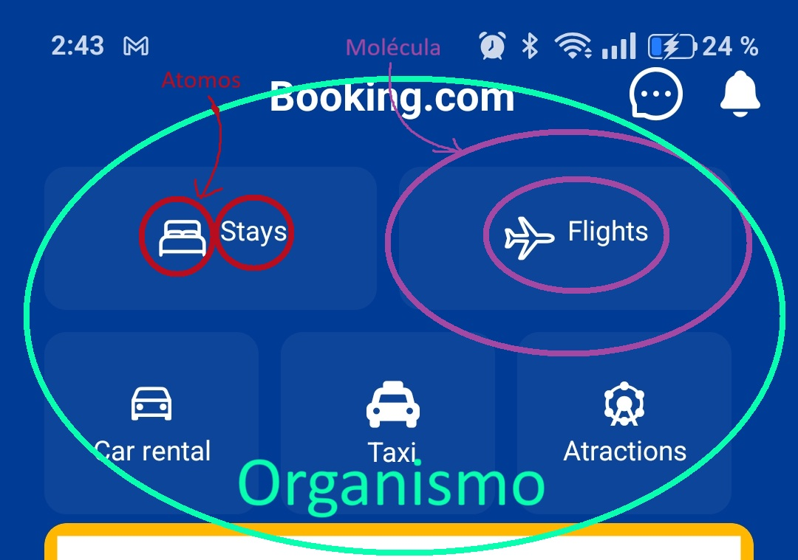

# Ejercicio 2

Atomic design es una metodologia empleada para crear diseños de forma organizada siendo que descompone la interfaz del usuario en  5 niveles: 

1. Átomo que es el mas pequeño.
2. Moleculas.
3. Organismos. 
4. Plantillas.
5. Páginas.

En el proyecto se pueden ver distintos tipos de niveles desde átomos hasta organismos siendo por ejemplo un \<Text> o \<View> ejemplos de Átomos muy utilizados

El conjunto de estos Viene a ser una molecula y por consecuente, un organismo es el conjunto de moléculas.

He aqui un ejemplo:

 